# Автор - Азимов Адам

# Отчет по лабораторной работе №1 Базовая настройка PostgreSQL на Debian

## 1. Подготовка среды

   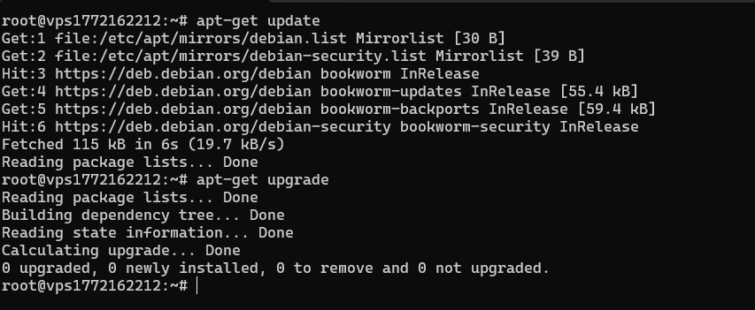

- apt-get update — обновляет информацию о доступных пакетах из репозиториев
- apt-get upgrade — обновляет установленные пакеты до последних версий

## 2. Установка PostgreSQL

С помощью пакетного менеджера apt был установлен PostgreSQL
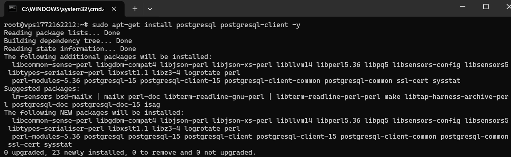

### Проверка версии

   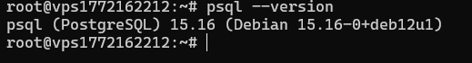

- PostgreSQL версии 15 успешно установлен.

## 3. Создание служебной учётной записи

Проверка наличия пользователя postgres:
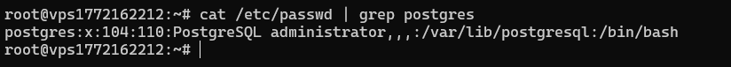

Учётная запись postgres создается автоматически при установке PostgreSQL. Это системный пользователь, от имени которого запускается сервер БД. Он имеет полный административный доступ ко всем базам данных.

## 4. Первичная настройка конфигурационных файлов

Поиск конфигурационных файлов:
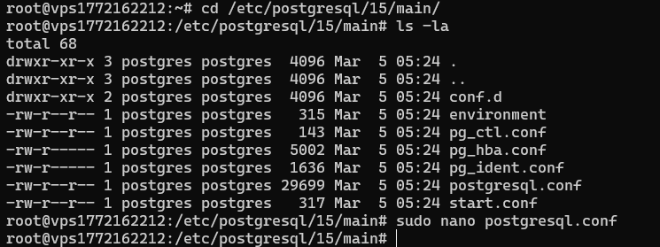

Редактирование postgresql.conf:
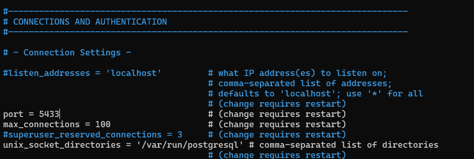

- был изменен порт с 5432 на 5433

Далее необходимо перезапустить postgresql:

```
sudo systemctl restart postgresql
```

## 5. Управление сервисом

Необходимо проверить статус сервиса PostgreSQL, включить автозапуск.
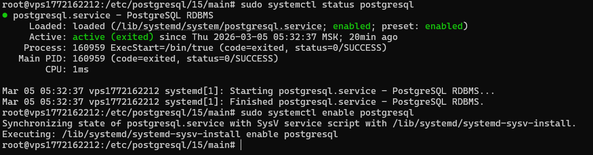

Команды управления сервисом:

- Проверка статуса: sudo systemctl status postgresql
- Включение автозапуска: sudo systemctl enable postgresql

## 6. Создание тестовой базы данных

Необходимо создать отдельного пользователя в PostgreSQL и новую базу данных
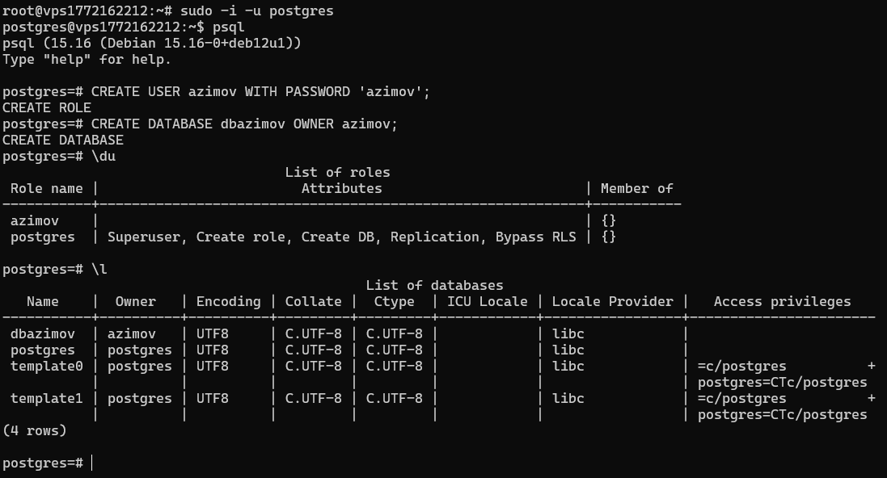

Подключение под новым пользователем
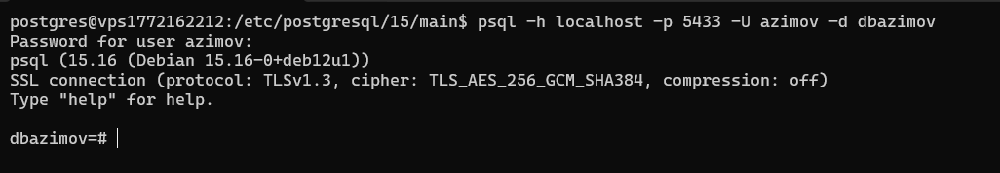

## 7. Знакомство со схемами

Необходимо создать новую схему test_schema
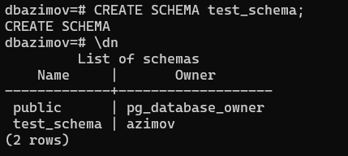

Теперь нужно настроить права на использование схемы

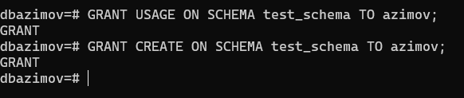

- База данных — изолированное окружение, содержащее все объекты
- Схема — логическая группировка объектов внутри одной БД (пространство имен)

## 8. Использование утилиты psql для базовых операций

Теперь необходимо в схеме public создать тестовую таблицу, внести несколько записей, выполнить основные SQL-запросы (SELECT, INSERT, UPDATE, DELETE).

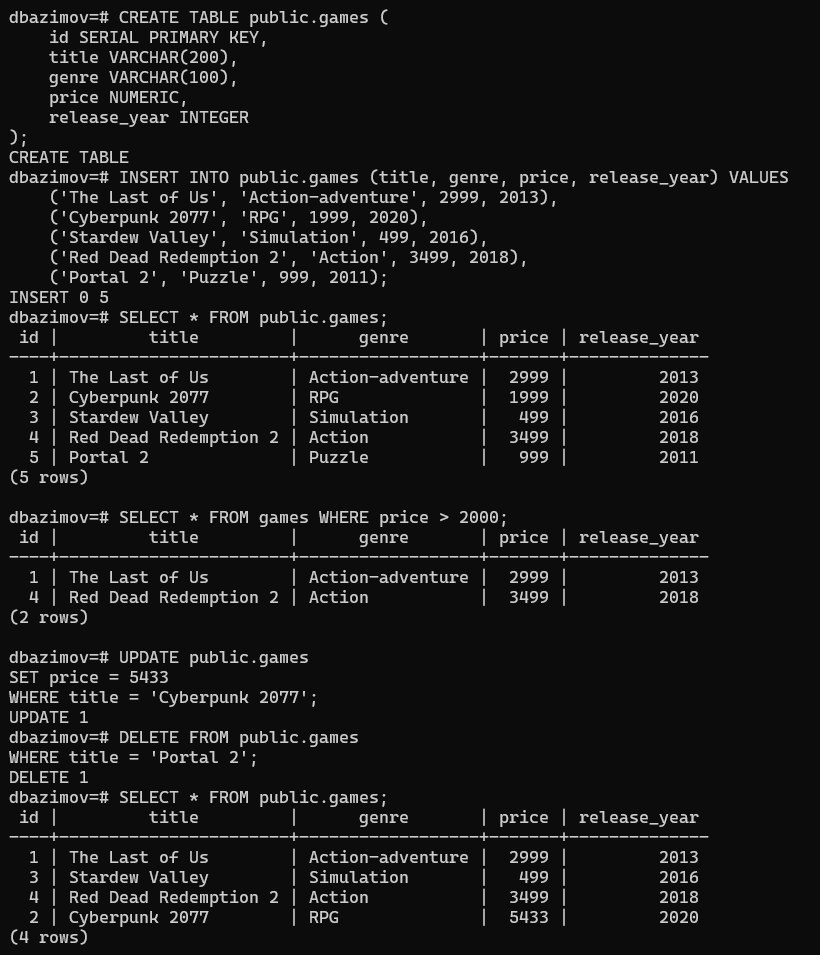

А для схемы test_schema нужно создать другую таблицу и внести несколько записей.

Работа со схемой test_schema:

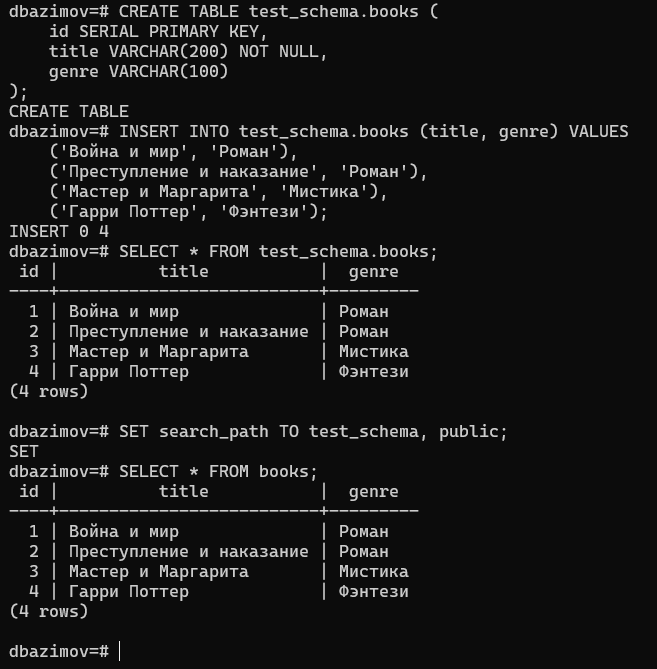

## 9. Настройка локальных и сетевых подключений

Изменение конфигурации для сетевого доступа:

- для файла postgresql.conf добавлено поле `listen_addresses = '*'` чтобы сервер принимаk подключения на всех сетевых интерфейсах
- для файла pg_hba.conf обновлено поле `host    dbazimov    azimov    0.0.0.0/0    md5` это разрешает TCP/IP подключения

Далее необходимо подключиться к postgres через pgadmin с локальной машины.
Настроки подключения к серверу:
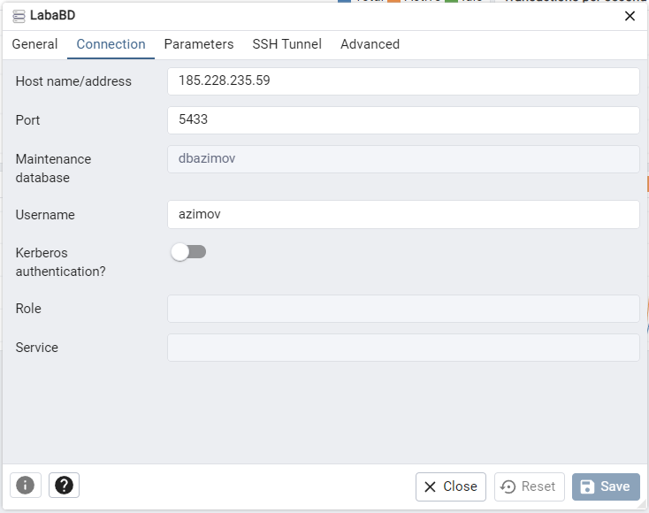

Просмотр таблиц:
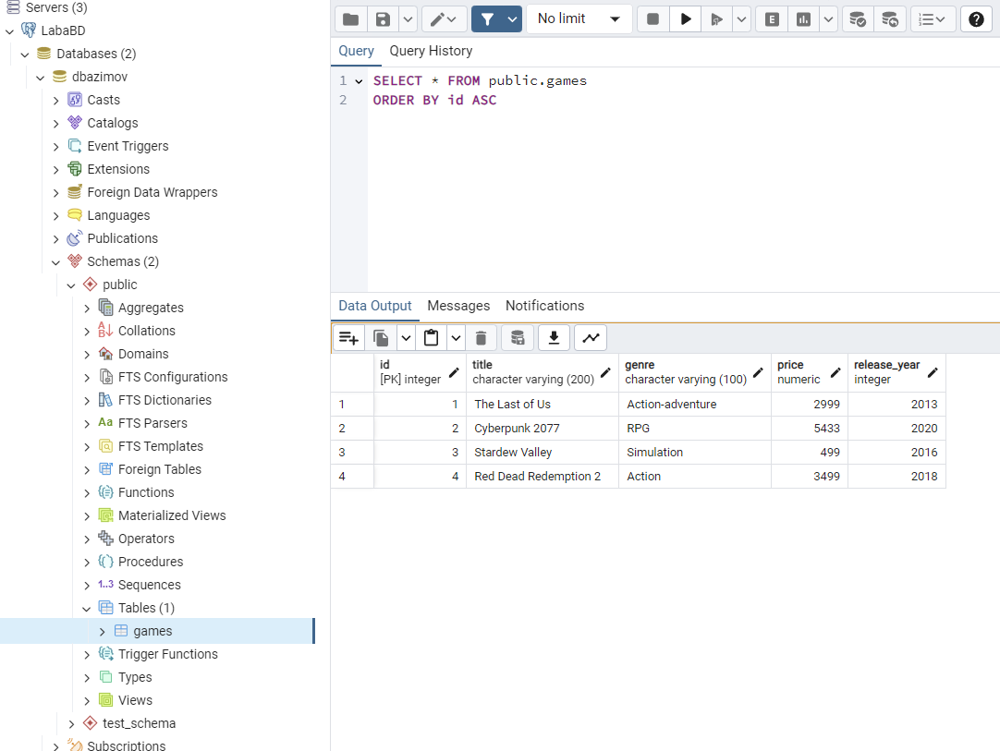

## 10. Журналирование (logging)

Теперь необходимо настроить параметры логирования:

- для файла postgresql.conf были добавлены параметры :

```
logging_collector = on
log_directory = 'log'
log_filename = 'postgresql-%Y-%m-%d_%H%M%S.log'
log_statement = 'all'  # Логировать все запросы
log_min_duration_statement = 1000  # Логировать запросы длительнее 1 сек
log_connections = on
log_disconnections = on
```

Для проверки логгов с pgadmin был отправлен sql запрос:

```sql
SELECT * FROM public.games
ORDER BY id ASC
```

Результат логов:
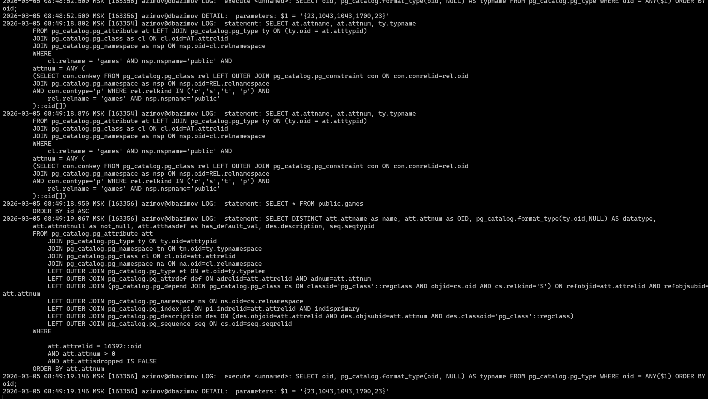

## 11. Назначение ролей и прав

Создание роли с ограниченными правами:
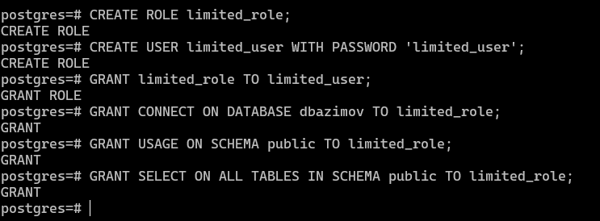

Разрешаем для роли limited_role подключаться к базе данных dbazimov.
Разрешаем для роли limited_role видеть и использовать схему public в базе данных.
Разрешаем для роли limited_role читать данные из всех существующих таблиц в схеме public.

Тестирование прав:
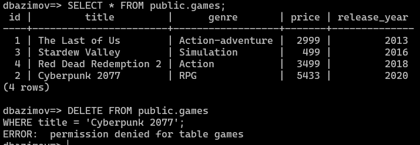

Объяснение наследования прав:
В PostgreSQL права наследуются от ролей к пользователям. Пользователь limited_user получает все права, назначенные роли limited_role. Это позволяет создавать иерархии прав и упрощает управление доступом.

## Заключение

В ходе выполнения лабораторной работы были успешно освоены базовые навыки администрирования СУБД PostgreSQL в среде Debian получены практические навыки работы с утилитой psql для выполнения базовых SQL-операций.
