# Автор - Азимов Адам

# Отчет по лабораторной работе №2: резервное копирование, восстановление и мониторинг в Debian и PostgreSQL

## 1. Утилиты резервного копирования

- `pg_dump`: Утилита для логического копирования. Создает дамп в виде SQL-команд или в специальных форматах.Восстановление дольше, так как выполняет INSERT/COPY.

- `pg_basebackup`: Утилита для физического копирования. Копирует файлы кластера целиком на момент запуска. Используется для настройки репликации и полного восстановления кластера.

## 2. Создание полной резервной копии

### Форматы дампов

Всего в PostgreSQL есть 4 формата:

- plain (стандартный)
- custom
- tar
- dir

TOC — Table of Contents, оглавление резервной копии, которое отражает, какой контент содержится в дампе, в каком порядке его нужно восстанавливать и какие есть зависимости между объектами.

#### plain

Дамп представляет собой один текстовый SQL-файл. Данный формат позволяет редактировать копию, а также удобно переходить между СУБД. Реализация представляет собой генерирование SQL-команд.
Преимущества:

- Отличный вариант для миграции
- Прозрачность дампа

Недостатки:

- Невозможно выборочное восстановление
- Не поддерживает параллельное восстановление
- Отсутствует сжатие

Пример использования:
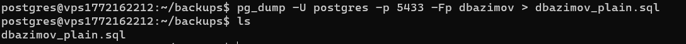

#### custom

Резервная копия сохраняется в бинарном формате. Дамп содержит TOC.

Преимущества:

- Выборочное восстановление, можно использовать фильтры для восстановления только частей дампа
- Поддержка параллельного восстановления
- Сжатие

Недостатки:

- Невозможность читать дамп, пока не восстановишь его

Пример использования:
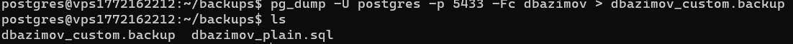

#### tar

Дамп сохраняется как tar-архив, который содержит файлы с данными, SQL-файл со структурой и TOC.

Преимущества:

- Удобство транспортировки
- Есть возможность восстановиться с помощью tar -xvf без использования pg_restore
- Выборочное восстановление

Недостатки:

- Отсутствует сжатие
- Не поддерживает параллельное восстановление

Пример использования:
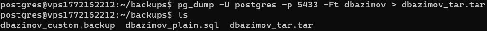

#### dir

Сам дамп представляет собой директорию, содержащую сжатые данные и TOC.

Преимущества:

- Есть поддержка параллельного дампа и восстановления
- Есть сжатие
- Быстро работает с большими объёмами данных

Недостатки:

- Неудобные хранение и транспортировка

Пример использования:
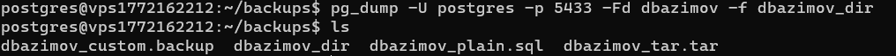

Другие параметры:

- -Z: уровень сжатия (0-9)
- -v: подробный вывод процесса

---

## 3. Частичное (выборочное) резервное копирование

### Дамп только определённой схемы

Дамп схемы test_schema

```bash
pg_dump -U postgres -p 5432 -Fc -n test_schema dbazimov > test_schema.backup
```

### Дамп только определённых таблиц

Дамп таблицы employees из схемы public

```bash
pg_dump -U postgres -p 5432 -Fc -t public.games dbazimov > games_table.backup
```

Объяснение отличий:

- Дамп всей базы содержит все объекты (таблицы, функции, индексы, права доступа и т.д.)
- Дамп схемы сохраняет структуру всех объектов в схеме, но не затрагивает другие схемы
- Дамп таблиц сохраняет только структуру и данные указанных таблиц, без зависимостей (например, внешних ключей)

## 4. Восстановление из резервной копии

### Удаление схемы test_schema

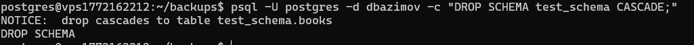

### Восстановление схемы test_schema

pg_restore -U postgres -d dbazimov_restore -n test_schema -v test_schema.backup

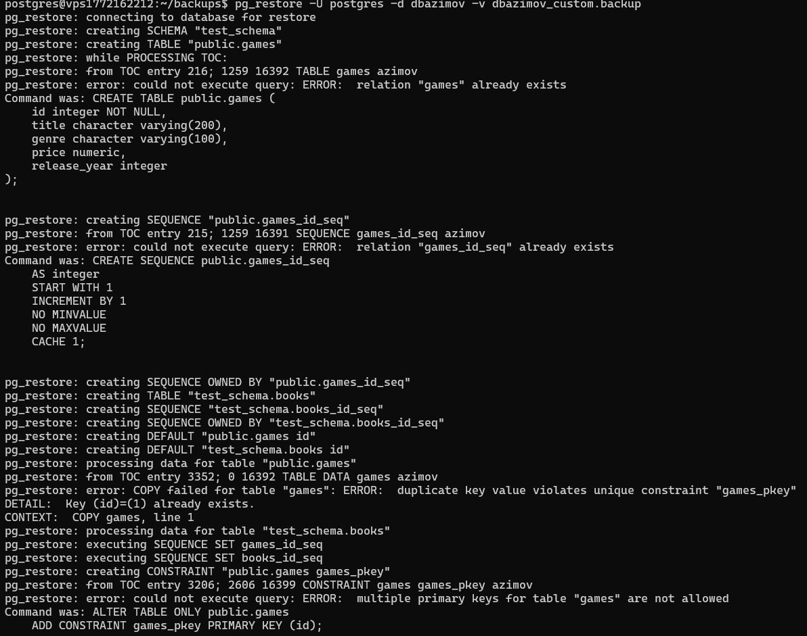

## 5. Автоматизация бэкапов с помощью cron

Сначала необходимо создать файл `backup_postgresql.sh` и записать туда скрипт:

```bash
#!/bin/bash

cd /tmp || exit 1

BACKUP_DIR="/var/backups/postgresql"
DB_NAME="dbazimov"
DATE=$(date +%Y%m%d_%H%M%S)
BACKUP_FILE="$BACKUP_DIR/${DB_NAME}_${DATE}.backup"
LOG_FILE="/var/log/postgresql/backup.log"

mkdir -p $BACKUP_DIR

find $BACKUP_DIR -name "${DB_NAME}_*.backup" -mtime +3 -delete

pg_dump -U postgres -Fc $DB_NAME > $BACKUP_FILE

if [ $? -eq 0 ]; then
    echo "$(date): Backup создан: $BACKUP_FILE" >> $LOG_FILE

    gzip -f $BACKUP_FILE
    echo "$(date): Backup compressed" >> $LOG_FILE
else
    echo "$(date): Backup FAILED!" >> $LOG_FILE
fi

BACKUP_SIZE=$(du -h ${BACKUP_FILE}.gz | cut -f1)
echo "$(date): Backup size: $BACKUP_SIZE" >> $LOG_FILE
```

Далее необходимо настроить `cron`:
`sudo crontab -u postgres -e`

### Ежедневный бэкап

```bash
0 10 * * * /usr/local/bin/backup_postgresql.sh
```

    0 — минута (30-я минута)
    10 — час (2 часа ночи)
    * — каждый день месяца
    * — каждый месяц
    * — каждый день недели

Будет выполняться каждый день в 10:00 утра.

### Список настроенных задач cron

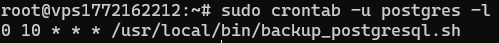

### Ручной запуск скрипта и провека созданных бэкапов

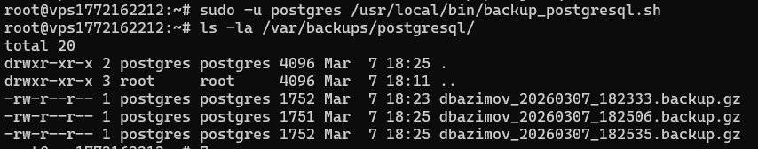

#### `Ротация бэкапов` - это процесс управления старыми копиями, когда старые файлы удаляются, освобождая место для новых. В скрипте используется find ... -mtime +3 -delete для удаления файлов старше 3 дней.

## 6. Мониторинг состояния системы

Сначала необходимо установить инструменты для мониторинга

```bash
sudo apt-get install htop iotop iftop sysstat
```

### Запуск top

`top`
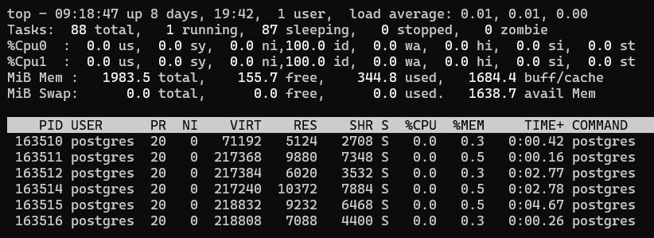

В top можно нажать:

- 1 - показать все ядра CPU
- Shift+M - сортировка по памяти
- Shift+P - сортировка по CPU
- u - показать процессы конкретного пользователя (введите postgres)
- q - выход

### Использование htop

`htop`

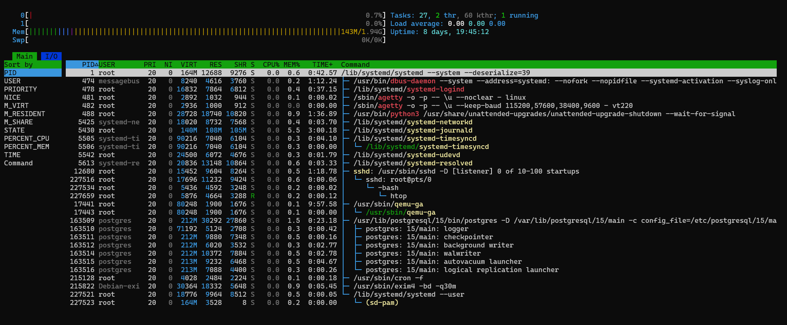

Клавиши:

- F4 - поиск
- F5 - дерево процессов
- F6 - сортировка
- F9 - убить процесс
- F10 - выход

### Мониторинг дискового ввода-вывода

`sudo iotop -o`


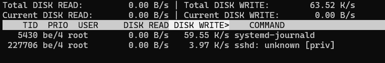

### Мониторинг сети для PostgreSQL порта

`sudo iftop -P -N -f "port 5433"`

Через приложение `pgadmin` был произведен соидинение к Базе данных и вот рузультат отображение логов соединения:
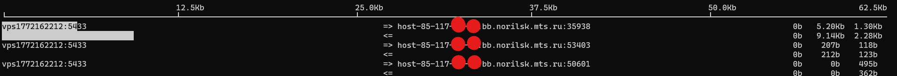

## 7. Мониторинг PostgreSQL

- `pg_stat_activity`: показывает текущую активность всех подключений к серверу (какие запросы выполняются прямо сейчас, кто подключен, сколько времени висит запрос).

- `pg_stat_database`: показывает накопительную статистику по каждой базе данных (сколько транзакций выполнено, сколько кортежей прочитано/возвращено, количество коммитов/откатов, время простоя).

### С помощью представления `pg_stat_activity` получим активные подключения:

```sql
SELECT
    pid,
    usename,
    application_name,
    client_addr,
    state,
    query,
    age(now(), query_start) as query_duration
FROM pg_stat_activity
WHERE state = 'active'
ORDER BY query_duration DESC;
```


### Теперь используя представления `pg_stat_database` получим статистика по базам данных:

```sql
SELECT
    datname,
    numbackends as connections,
    xact_commit as commits,
    xact_rollback as rollbacks,
    blks_read as disk_reads,
    blks_hit as cache_hits,
    (blks_hit::float / (blks_hit + blks_read) * 100) as cache_hit_ratio
FROM pg_stat_database;
```

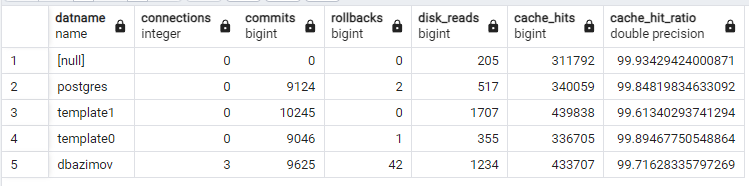

### Теперь принудительно завершим процесс

```bash
SELECT pg_terminate_backend(228872);
```

## 8. Логирование и анализ логов

### Логи PostgreSQL

```bash
sudo tail -f /var/lib/postgresql/15/main/log/postgresql-2026-03-08_115629.log
```

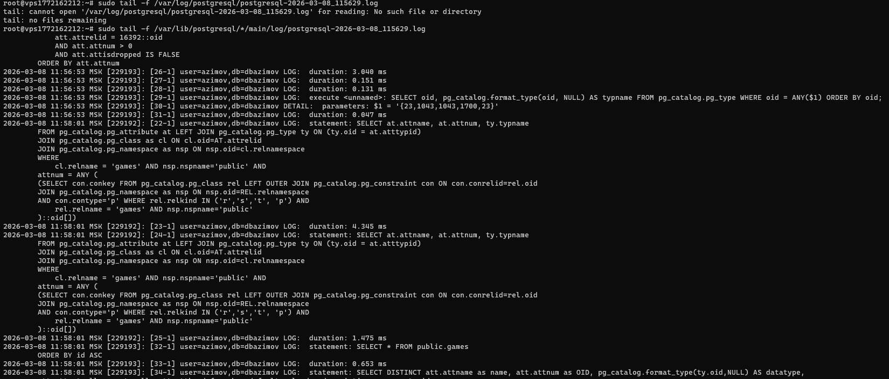

### Системные логи Debian

Просмотр всех файлов в дириктории

```bash
sudo ls -la /var/log/
```

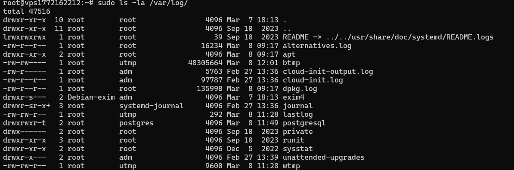

Файлы syslog и daemon.log в дириктории нету.

## Заключение:

В ходе выполнения лабораторной работы были освоены методы резервного копирования и восстановления баз данных PostgreSQL с использованием утилит pg_dump и pg_basebackup, а также изучены инструменты мониторинга состояния системы и СУБД. Полученные навыки автоматизации бэкапов с помощью cron и анализа логов позволяют обеспечить надежное функционирование баз данных и своевременное выявление проблем в продуктивной среде.

