# Автор - Азимов Адам

# Отчет по лабораторной работе №3: Расширенные возможности и оптимизация PostgreSQL на Debian

## 1. Оптимизация конфигурации PostgreSQL

### Основные параметры конфигурации

Назначение параметров:

- shared_buffers - объем памяти для кэширования данных PostgreSQL (15-25% от RAM)
- work_mem - память для операций сортировки и хеширования
- maintenance_work_mem - память для операций обслуживания (5-10% от RAM)
- effective_cache_size - оценка размера системного кэша файлов (50-75% от RAM)

Оперативная память сервера составляет 2 гигабайта:
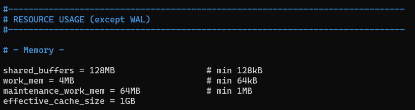

Проверка установленных значений:

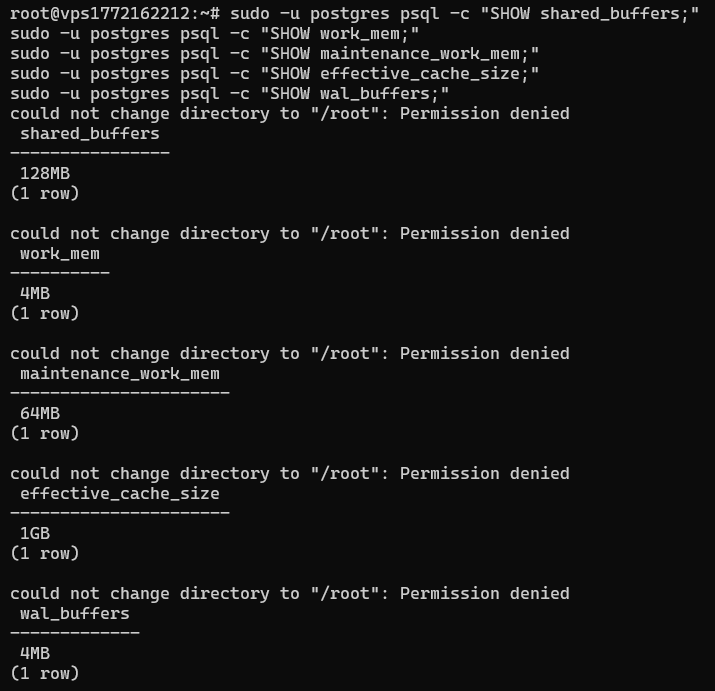

## 2. Создание и анализ индексов

Используем таблицу games из прошлой лабораторной работы:
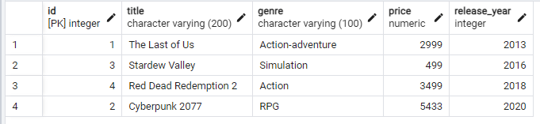

### Запросы ДО создания индексов:

#### Запрос 1: Поиск по жанру

```sql
EXPLAIN (ANALYZE, BUFFERS)
SELECT * FROM public.games
WHERE genre = 'RPG';
```

Результат:
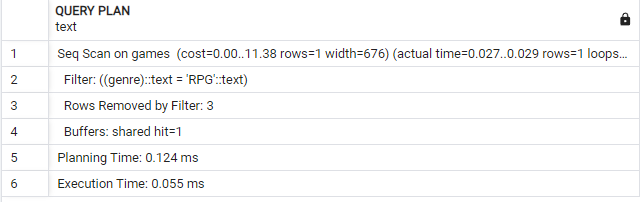

#### Запрос 2: Поиск по году выпуска

```sql
EXPLAIN (ANALYZE, BUFFERS)
SELECT title, price FROM public.games
WHERE release_year = 2020;
```

Результат:
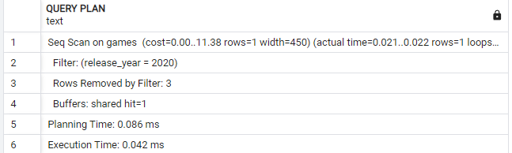

#### Запрос 3: C несколькими условиями

```sql
EXPLAIN (ANALYZE, BUFFERS)
SELECT * FROM public.games
WHERE genre = 'Action'
  AND price < 1000
  AND release_year > 2015;
```

Результат:
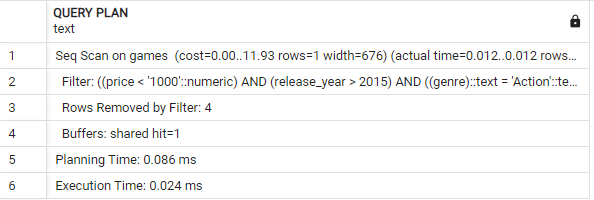

### Создание индексов

#### 1. Индекс по жанру

```sql
CREATE INDEX idx_games_genre ON public.games(genre);
```

#### 2. Индекс по году выпуска

```sql
CREATE INDEX idx_games_release_year ON public.games(release_year);
```

#### 3. Индекс для комбинированного запроса

```sql
CREATE INDEX idx_games_genre_price ON public.games(genre, price);
```

Результат созданных идексов:
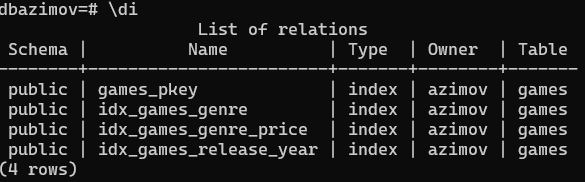

### Запросы ПОСЛЕ создания индексов:

#### Запрос 1: Поиск по жанру

```sql
EXPLAIN (ANALYZE, BUFFERS)
SELECT * FROM public.games
WHERE genre = 'RPG';

```

Результат:
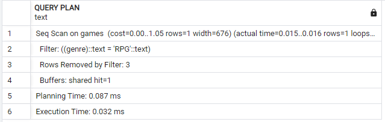

#### Запрос 2: Поиск по году выпуска

```sql
EXPLAIN (ANALYZE, BUFFERS)
SELECT title, price FROM public.games
WHERE release_year = 2020;
```

Результат:
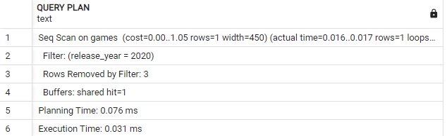

#### Запрос 3: C несколькими условиями

```sql
EXPLAIN (ANALYZE, BUFFERS)
SELECT * FROM public.games
WHERE genre = 'Action'
  AND price < 1000
  AND release_year > 2015;
```

Результат:
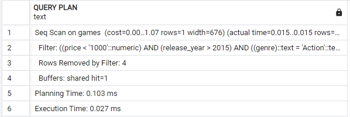

### Таблица результатов:

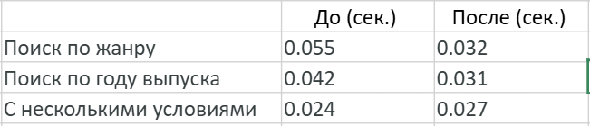

Анализ таблицы показывает, что индексы действительно помогают ускорить поиск — запросы по жанру и по году стали выполняться быстрее примерно в полтора раза. А вот со сложным запросом, где сразу несколько условий, индекс немного не справился — время даже чуть выросло, для маленько таблицы это приемлимо.

## 3. Хранимые функции

### Создание функции для добавления игры

```sql
CREATE FUNCTION public.add_game(
    p_title VARCHAR(200),
    p_genre VARCHAR(100),
    p_price DECIMAL(10, 2),
    p_release_year INTEGER
)
RETURNS TEXT AS $$
DECLARE
    v_game_id INTEGER;
    v_result TEXT;
BEGIN
    IF p_title IS NULL OR LENGTH(TRIM(p_title)) = 0 THEN
        RETURN 'Ошибка: Название игры не может быть пустым';
    END IF;

    IF p_price < 0 THEN
        RETURN 'Ошибка: Цена не может быть отрицательной. Указана цена: ' || p_price;
    END IF;

    INSERT INTO public.games (title, genre, price, release_year)
    VALUES (p_title, p_genre, p_price, p_release_year)
    RETURNING id INTO v_game_id;

    RETURN 'Запись добавлена!';

EXCEPTION
    WHEN OTHERS THEN
        RETURN 'Ошибка при добавлении';
END;
$$ LANGUAGE plpgsql;
```

### Проверка работы функции

1. Успешное добавление:

```sql
SELECT public.add_game('Elden Ring', 'RPG', 3500, 2022);
```

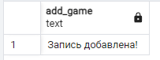

2. Ошибка с отрицательной ценой:

```sql
SELECT public.add_game('Bad Game', 'Action', -500, 2023);
```


3. Проверка результатов вставки
   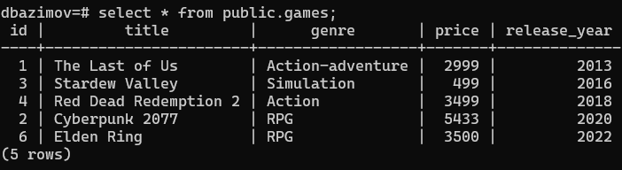

## 4. Триггеры

### Создание триггерной функции

Функция для проверки, чтобы год выпуска не могла быть в будущем

```sql
CREATE OR REPLACE FUNCTION public.check_game_rules()
RETURNS TRIGGER AS $$
BEGIN
    IF NEW.release_year > EXTRACT(YEAR FROM CURRENT_DATE) THEN
        RAISE EXCEPTION 'Ошибка: Год выпуска (%) не может быть больше текущего (%)',
            NEW.release_year, EXTRACT(YEAR FROM CURRENT_DATE);
    END IF;

    RAISE NOTICE 'Игра прошла проверку';

    RETURN NEW;
END;
$$ LANGUAGE plpgsql;
```

### Создание триггера

### 1. BEFORE INSERT Создание триггера до вставки данных

```sql
CREATE TRIGGER trigger_check_game_rules_before_insert
    BEFORE INSERT ON public.games
    FOR EACH ROW
    EXECUTE FUNCTION public.check_game_rules();
```

### 2. BEFORE UPDATE Создание триггера для обновлении данных

```sql
CREATE TRIGGER trigger_check_game_rules_before_update
    BEFORE UPDATE ON public.games
    FOR EACH ROW
    EXECUTE FUNCTION public.check_game_rules();
```

### Тестирование триггера

### 1. Проверка триггера при вставке данных (BEFORE INSERT)

```sql
INSERT INTO public.games (title, genre, price, release_year)
VALUES ('Future Game', 'RPG', 5000, 2027);
```

Результат триггер успешно срабатывает:
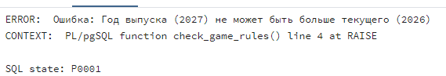

### 2. Проверка триггера до обновления данных (BEFORE UPDATE)

```sql
UPDATE public.games
SET release_year = 2027
WHERE title = 'Elden Ring';
```

Результат триггер успешно срабатывает:
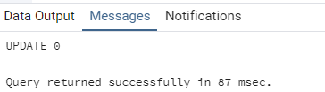

## 5. Автоматическая очистка и статистика (VACUUM, ANALYZE)

### 1. Теория

`VACUUM`:

- освобождает это место, делая его доступным для новых записей.

`ANALYZE`:

- Анализирует содержимое таблиц, собирает статистику. Эта статистика используется планировщиком запросов для выбора наиболее эффективного способа выполнения SQL-команд. Без актуального ANALYZE запросы могут работать медленно, так как планировщик выбирает неоптимальные пути.

`Autovacuum` - Запускается автоматически когда много мертвых строк

Для автоматического срабатывания существует `AUTOVACUUM`
Основные параметры `AUTOVACUUM`:

- autovacuum_vacuum_threshold — минимальное количество изменённых строк для запуска.
- autovacuum_vacuum_scale_factor — доля измененных строк от общего числа, для запуска.
- autovacuum_naptime - как часто просыпается autovacuum для проверки
  Пример:

```sql
ALTER TABLE public.games
  SET (autovacuum_vacuum_threshold = 500,
       autovacuum_vacuum_scale_factor = 0.05);
```

VACUUM запустится, если в таблице изменилось более 500 строк или 5% от общего числа.

Основные параметры `ANALYZE`:

- autovacuum_analyze_threshold - минимальное количество изменённых строк для запуска.
- autovacuum_analyze_scale_factor — доля измененных строк от общего числа, для запуска.

Пример:

```sql
ALTER TABLE public.games
  SET (autovacuum_analyze_threshold = 250,
       autovacuum_analyze_scale_factor = 0.02);
```

### 2. Проверка текущего состояния таблицы games

```sql
SELECT
    relname as table_name,
    n_live_tup as живых_строк,
    n_dead_tup as мертвых_строк
FROM pg_stat_user_tables
WHERE relname = 'games';
```

Результат:
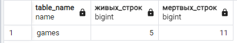

### 3. Ручная очистка VACUUM ANALYZE

```sql
VACUUM ANALYZE public.games;
```

Результат после ручной очистки:
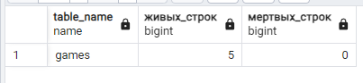

### 4. Настройка autovacuum для таблицы

```sql
ALTER TABLE public.games SET (
    autovacuum_vacuum_scale_factor = 0.1,   -- 10% изменений
    autovacuum_vacuum_threshold = 10,       -- минимум 100 мертвых строк
    autovacuum_analyze_scale_factor = 0.05, -- 5% изменений
    autovacuum_analyze_threshold = 50,      -- минимум 50 изменений
    autovacuum_enabled = on                 -- включено
);
```

## Заключение

В ходе лабораторной работы были освоены методы оптимизации PostgreSQL: настройка параметров памяти под 2 ГБ ОЗУ, создание индексов для ускорения запросов, разработка хранимых функций и триггеров для проверки данных, а также изучен механизм autovacuum и системные представления статистики.
